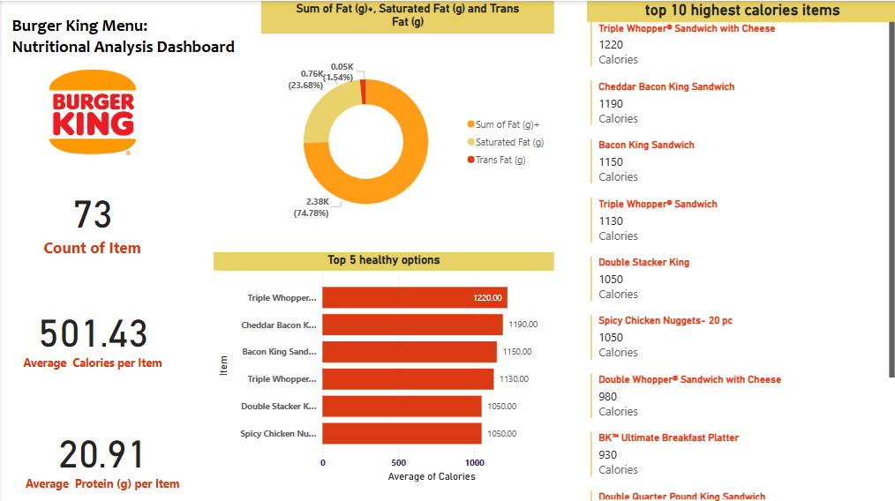

# 🍔 Burger King Menu – Nutritional Analysis Dashboard

This project analyzes the nutritional values of Burger King menu items using Power BI. It includes calorie counts, fat content, sugar, protein, sodium, and more. The aim is to help consumers and data enthusiasts better understand the nutritional makeup of common fast food items.

---

## 📊 Dashboard Overview

The dashboard was created in Power BI and includes:

- **KPI Cards** showing:
  - Total number of items
  - Average calories
  - Maximum sugar or sodium
- **Bar Charts**:
  - Top 10 highest calorie items
  - Top 5 healthiest (lowest calorie) items
- **Pie/Donut Chart** showing item distribution by category
- **Clustered Bar Chart** for:
  - Most sold items
- **Slicers** for:
  - Category
  - Calorie range
  - Month (if sales data is included)

---

## 📁 Files Included

- `BurgerKingDashboard.pbix`: Power BI file with all visuals and embedded data
- `BKSS.png`: A snapshot of the dashboard
- `README.md`: This documentation file

> 📌 **Note**: The data tables used in the dashboard are embedded within the Power BI `.pbix` file and were created in the Table view.

---

## 📷 Dashboard Preview

---

## 📌 How the Data Was Used

- Dataset contains menu items with the following nutritional values:
  - Calories
  - Fat
  - Sugar
  - Protein
  - Sodium
- Data cleaning, transformation, and modeling were done within Power BI using **Power Query Editor**.
- Visuals were built using native Power BI charts and slicers.

---

## 👩‍💻 About Me

**Kanishka Kumari**  
Final-year BTech Student | Certified Data Analyst  
**Email:** kanishkaa040104@gmail.com  
**LinkedIn:** [www.linkedin.com/in/kanishka-kumari04](https://www.linkedin.com/in/kanishka-kumari04)

---

## ⭐ Highlights

- Built using Power BI
- Clean, interactive dashboard with user slicers
- Top N filtering for calorie-based and sales-based analysis
- Includes healthy item detection using nutrition filters

---

## 🚀 How to View

To view the dashboard:
1. Download the `.pbix` file
2. Open it using [Power BI Desktop](https://powerbi.microsoft.com/desktop/)

---

## 🔖 Tags

`Power BI` `Burger King` `Data Visualization` `Nutritional Analysis` `Dashboard` `Top N Filtering` `Healthy Eating` `Fast Food`

